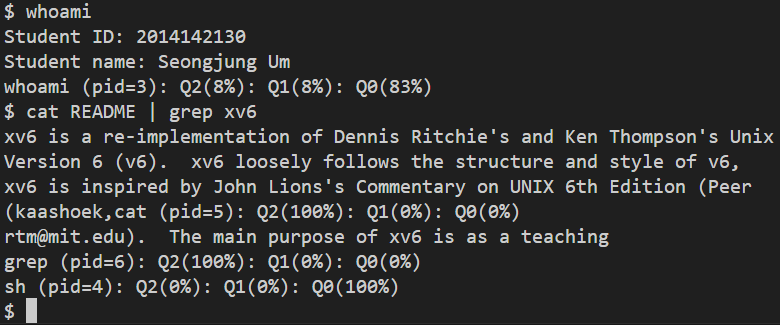
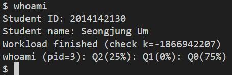

# Assignment 3: Process Scheduling Implementation

## 1. 문제 정의 (Problem Definition)
기본 xv6 커널의 Round-Robin 스케줄러는 모든 프로세스를 평등하게 대우하기 때문에, 빠른 응답성이 필요한 대화형(Interactive) 작업과 긴 연산이 필요한 작업(Compute-intensive)을 구분하지 못한다. 본 프로젝트는 이를 개선하기 위해 **Multi-level Queue (Q2, Q1, Q0)** 기반의 스케줄링 정책을 커널에 구현하는 것을 목표로 한다.

* **Q2 (High Priority):** 대화형 프로세스용 (기본 할당, Round-Robin 순회)
* **Q1 (Low Priority):** 연산 집약적 프로세스용 (Q2 순회 완료 후 1회 실행)
* **Q0 (Wait Queue):** Sleep/Zombie 상태의 비실행 프로세스 관리

## 2. 구현 전략 (Implementation Strategy)

**1) Queue Data Structure & Management**
* 기존 `proc` 배열 검색 방식을 제거하고, `struct proc`에 `q_next`, `q_prev` 포인터를 추가하여 **Doubly Linked List**로 각 큐를 관리하였다.
* `enqueue(p, level)`와 `dequeue(p)` 함수를 구현하여 프로세스 상태 변화 시 큐 간 이동을 $O(1)$ 시간 복잡도로 처리하고, 포인터 오류로 인한 커널 패닉을 방지하였다.

**2) Scheduling Policy Logic**
* **Execution Order:** `scheduler()` 함수를 재작성하여 **"Q2 전체 순회 -> Q1 1개 프로세스 실행 -> Q2 전체 순회"**의 고정된 우선순위 로직을 구현하였다.
* **State Transition & Aging:**
    * **Demotion (Q2 -> Q1):** 타이머 인터럽트(`yield`) 발생 시, 타임 슬라이스를 모두 소진한 프로세스를 하위 큐로 강등시켜 CPU 독점을 막았다.
    * **Promotion (Any -> Q2):** 프로세스가 `wakeup` 하거나 `syscall`을 호출하는 경우(I/O 발생 간주), 대화형 작업일 가능성이 높으므로 즉시 Q2로 승격시켰다.
    * **Wait (Any -> Q0):** `sleep` 호출 시 실행 큐에서 제거하여 불필요한 스케줄링 오버헤드를 제거하였다.

**3) Statistics Tracking**
* 매 틱(`clockintr`)마다 프로세스의 현재 큐 레벨을 확인하여 `ticks_q0`, `ticks_q1`, `ticks_q2` 통계를 집계하였고, 프로세스 종료(`freeproc`) 시 이를 백분율로 출력하여 스케줄링 결과를 검증하였다.

## 3. 결과 (Results)

**Case 1: Mixed Workload Verification**
`whoami` 테스트 프로그램을 통해 CPU 연산(Loop)과 I/O 대기(Pause)가 혼합된 워크로드를 수행한 결과이다.
* 좌측(`image-hw3-01`)에서는 CPU 사용량이 임계치를 초과하여 **Q1(8%)**으로 강등되는 현상이 관측되었다.
* 우측(`image-hw3-02`)에서는 I/O 대기로 인해 **Q0(75%)**와 **Q2(25%)**를 오가는 모습이 확인되었다.

| CPU Burst Focus | Dynamic Workload |
| :---: | :---: |
|  |  |

**Case 2: Interactive Process Priority**
파이프라인 명령어(`cat | grep`) 수행 결과, 짧은 실행 시간을 가지는 대화형 프로세스들이 **Q2(100%)**에 머무르며 최우선으로 처리됨을 확인하였다.

## 4. 기술적 성과 (Technical Accomplishment)
* **Advanced Scheduling Algorithm:** 단순 Round-Robin을 벗어나, 프로세스의 성격(Interactive vs Batch)에 따라 동적으로 우선순위를 조정하는 복합 스케줄링 알고리즘을 커널 레벨에서 구현하였다.
* **Kernel Data Structure:** 커널의 핵심 객체인 `proc` 구조체를 확장하고 Linked List를 직접 제어함으로써, 운영체제의 자료구조 관리 능력을 입증하였다.
* **Precise State Control:** `sleep`, `wakeup`, `yield`, `syscall` 등 커널의 주요 진입점마다 정확한 큐 이동 로직을 삽입하여 Deadlock이나 Starvation 없이 안정적인 시스템 동작을 보장하였다.