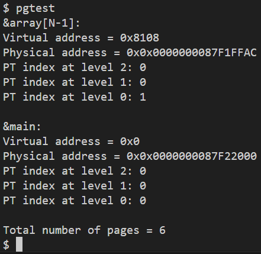

# Assignment 4: Paging (Virtual Memory Inspection System Calls)

## 1. 문제 정의 (Problem Definition)
본 프로젝트는 xv6-riscv 커널의 핵심인 **Sv39 가상 메모리(Paging) 구조**를 역으로 탐색하는 3가지 시스템 콜을 구현하는 것이다. 이를 통해 가상 주소(VA)가 물리 주소(PA)로 변환되는 전체 과정과 3단계 페이지 테이블(L2, L1, L0)의 인덱싱 방식을 코드로 증명하는 것을 목표로 한다.

## 2. 구현 전략 (Implementation Strategy)

**1) `phyaddr(va)` (VA to PA Translation)**
* `kernel/vm.c`의 `walkaddr` 함수를 활용하여 VA가 속한 물리 페이지의 시작 주소(Page Aligned PA)를 획득.
* VA의 하위 12비트(Offset)를 추출하여 PA 시작 주소에 더함으로써 정확한 물리 바이트 주소를 반환.

**2) `ptidx(va, level)` (Page Table Index)**
* RISC-V의 Sv39 Paging 스펙에 따라 VA의 비트 필드를 추출하는 로직을 사용.
* `kernel/riscv.h`에 정의된 **`PX` 매크로**를 활용하여 주어진 레벨(0, 1, 2)에 해당하는 9비트 인덱스를 정확히 반환. (Level 0: 비트 12-20, Level 1: 비트 21-29, Level 2: 비트 30-38)

**3) `pgcnt()` (Page Count Optimization)**
* 프로세스가 사용 중인 총 물리 페이지 수를 계산하기 위해 **재귀적 페이지 테이블 순회(Recursive Page Table Traversal)** 방식을 구현.
* **최적화(Pruning):** 상위 레벨(L2, L1)의 PTE가 유효하지 않으면 하위 레벨 탐색을 즉시 중단(`PTE_V` 검사)하여 불필요한 계산을 방지.

## 3. 결과 (Results)
`pgtest` 실행 결과, 코드 및 데이터 섹션의 가상 주소가 유효한 물리 주소로 정확하게 변환되었으며, 페이지 테이블 인덱싱 및 총 사용 페이지 수(6개)가 예상대로 출력됨을 확인하였다.

## 4. 기술적 성과 (Technical Accomplishment)
* **RISC-V Paging Mastery:** 3단계 페이지 테이블 구조와 VA-PA 변환의 모든 과정을 코드로 직접 증명.
* **Low-Level Bitwise Operations:** 인덱스 추출 및 오프셋 계산 등 커널 수준의 비트 연산을 정확히 수행.
* **Recursive Traversal:** 최적화를 위해 Page Table 트리를 순회하는 재귀 함수를 설계 및 구현.