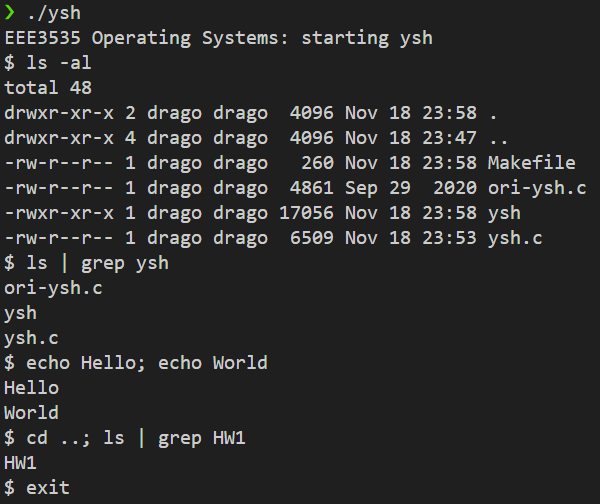
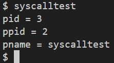

# Operating System Kernel (xv6-RISC-V) Internals Analysis and Implementation

## 1. 프로젝트 개요 (Overview)

본 프로젝트는 MIT에서 교육용으로 개발된 **xv6 운영체제 (RISC-V 아키텍처 버전)**를 분석하고, 핵심 컴포넌트(쉘, 시스템 콜, 스케줄러, 메모리 관리)를 직접 수정 및 확장함으로써 운영체제의 원리를 심층적으로 이해하는 것을 목표로 합니다.

**핵심 기술 및 사용 언어:**
* **운영체제 커널:** xv6-RISC-V
* **개발 언어:** C (커널), Shell Script (HW1), C++ (HW5 - 제외)
* **아키텍처:** RISC-V 64-bit

---

## 2. 주요 구현 과제 및 기술 성과

### HW1. 쉘 구현 (User Shell Implementation)

| 목표 | 구현 내용 | 성과 |
| :--- | :--- | :--- |
| **명령어 처리** | `&`를 이용한 백그라운드 프로세스 실행, I/O 리다이렉션 (`<`, `>`), 파이프 (`|`), 조건 실행 (`&&`, `||`) 등 복잡한 쉘 문법 해석 및 실행 | **프로세스 제어** 및 **파일 디스크립터 관리** (I/O) 원리 이해 |

**결과 화면 (HW1)**

### HW2. 시스템 콜 확장 (System Call Extension)

| 목표 | 구현 내용 | 성과 |
| :--- | :--- | :--- |
| **커널-유저 인터페이스** | 유저 영역 프로그램이 커널의 정보를 요청할 수 있도록 3개의 신규 시스템 콜(`sys_getpid`, `sys_getppid`, `sys_getpname`) 구현 | **시스템 콜 호출 과정** (유저 모드 -> 커널 모드 진입, Trap, 레지스터 인자 처리) 및 **프로세스 정보 접근** 방법 숙달 |

**결과 화면 (HW2)**

### HW3. 다단계 피드백 큐 스케줄러 구현 (Multi-Level Feedback Queue Scheduler, MLFQ)

| 목표 | 구현 내용 | 성과 |
| :--- | :--- | :--- |
| **스케줄링 알고리즘** | Round-Robin 방식의 3단계 큐(Q0, Q1, Q2)로 구성된 MLFQ 스케줄러 구현 및 우선순위 조정 로직 삽입 | **MLFQ 동작 원리** (Aging, Priority Boost, Time Slice) 이해 및 **커널 스케줄링 로직** 직접 수정 (CPU 활용률 개선) |

**결과 화면 (HW3)**

*(Note: whoami 명령어 실행 결과, 프로세스에 할당된 Q0/Q1/Q2의 CPU 점유율을 확인할 수 있음)*

### HW4. 페이징 시스템 콜 구현 (Paging System Call)

| 목표 | 구현 내용 | 성과 |
| :--- | :--- | :--- |
| **가상 메모리 탐색** | 가상 주소(VA)를 물리 주소(PA)로 변환하는 `phyaddr()`, 페이지 테이블 인덱스를 추출하는 `ptidx()`, 사용 중인 페이지 개수를 세는 `pgcnt()` 시스템 콜 구현 | **RISC-V Sv39 Paging 구조** (3단계 페이지 테이블) 분석, **VA-PA 변환 로직**의 깊이 있는 이해 및 **재귀적 페이지 테이블 순회** 구현 |

**결과 화면 (HW4)**

*(Note: `pgtest` 실행 결과, VA가 PA로 정확히 변환되고 유효 페이지 개수가 계산됨을 확인)*

---

## 3. 결론

본 프로젝트를 통해 프로세스 관리, 메모리 관리, 스케줄링 등 현대 운영체제의 핵심 기능을 커널 레벨(C 언어)에서 직접 구현 및 디버깅할 수 있는 능력을 확보했습니다. 이는 로우 레벨 시스템의 동작 원리에 대한 깊은 이해를 제공합니다.